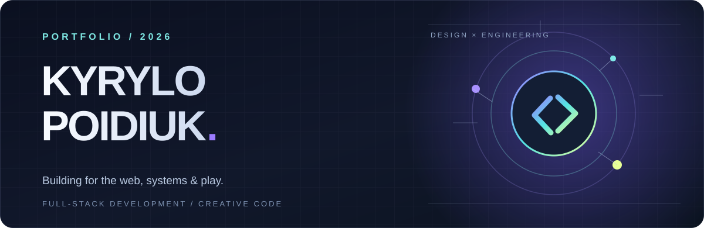
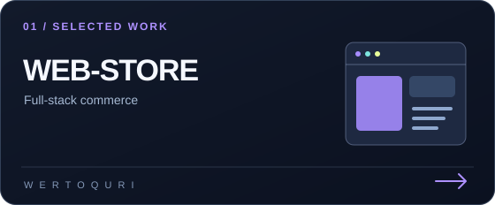
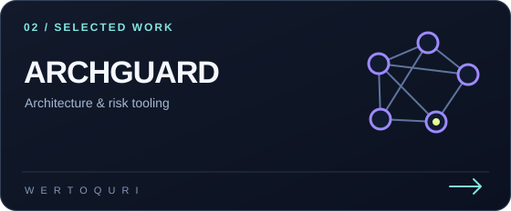
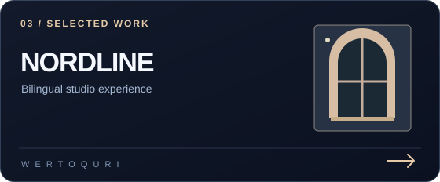
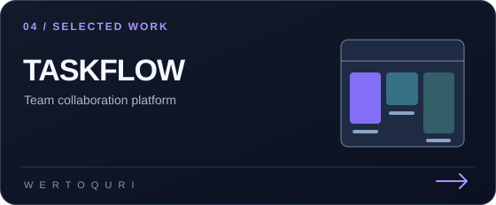

  

  

<h1 align="center">Hi, I'm Kyrylo 👋</h1>

  Full-stack developer in Kyiv, Ukraine. 
  I build thoughtful interfaces, practical developer tools, and games worth playing.

  <a href="https://portfolio-nine-lovat-87.vercel.app/">Explore my portfolio ↗</a>
  &nbsp;·&nbsp;
  <a href="https://github.com/Wertoquri?tab=repositories">Browse my code ↗</a>
  &nbsp;·&nbsp;
  <a href="https://instagram.com/wertoquri">Instagram ↗</a>

---

### A little about my work

I enjoy the whole journey from first sketch to working product: shaping an interface, connecting the API, designing the data model, and polishing the details. My work moves between **web products**, **engineering tools**, and **game development**.

Currently exploring **C# / .NET** and software architecture while building with **React, TypeScript, Node.js, and PostgreSQL**.

## Selected work

<table>
  <tr>
    <td width="50%" valign="top">
      
       <strong>WEB-store</strong> — a full-stack storefront with accounts, cart, checkout, reviews, and an admin workspace. Built with React, Express, Prisma, and PostgreSQL.
       <a href="https://github.com/Wertoquri/WEB-store">Repository ↗</a>
    </td>
    <td width="50%" valign="top">
      
       <strong>ARCHGUARD</strong> — an architecture policy and risk engine for JavaScript and TypeScript repositories, with a dependency graph and CI findings.
       <a href="https://github.com/Wertoquri/ARCHGUARD">Repository ↗</a> · <a href="https://archguard.vercel.app/">Live site ↗</a>
    </td>
  </tr>
  <tr>
    <td width="50%" valign="top">
      
       <strong>Nordline Studio</strong> — a bilingual interior design website with project stories, clear service journeys, and responsive layouts.
       <a href="https://github.com/Wertoquri/nordline-studio">Repository ↗</a> · <a href="https://nordline-studio-kyiv.vercel.app/">Live site ↗</a>
    </td>
    <td width="50%" valign="top">
      
       <strong>TaskFlow</strong> — a bilingual team workspace with Kanban boards, roles, invitations, notifications, and real-time chat.
       <a href="https://github.com/Wertoquri/TaskFlow">Repository ↗</a>
    </td>
  </tr>
</table>

## What I work with

| Area | Tools |
| :-- | :-- |
| **Interfaces** | React · TypeScript · JavaScript · HTML · CSS · Sass |
| **APIs & data** | Node.js · Express · Prisma · PostgreSQL · MySQL · MongoDB |
| **Game development** | Unity · C# |
| **Workflow** | Git · GitHub · Docker · Linux · VS Code |

## Beyond the browser

I also like building interactive worlds. Take a look at [Fishing Simulator 3D](https://github.com/Wertoquri/Fishing-simulator3D), [RoboStars](https://github.com/Wertoquri/RoboStars), and [TowerDefense](https://github.com/Wertoquri/TowerDefense).

---

  <strong>Have an idea to build together?</strong> 
  <a href="https://portfolio-nine-lovat-87.vercel.app/">Start with my portfolio ↗</a>

Made with curiosity, code, and a good eye for detail.

